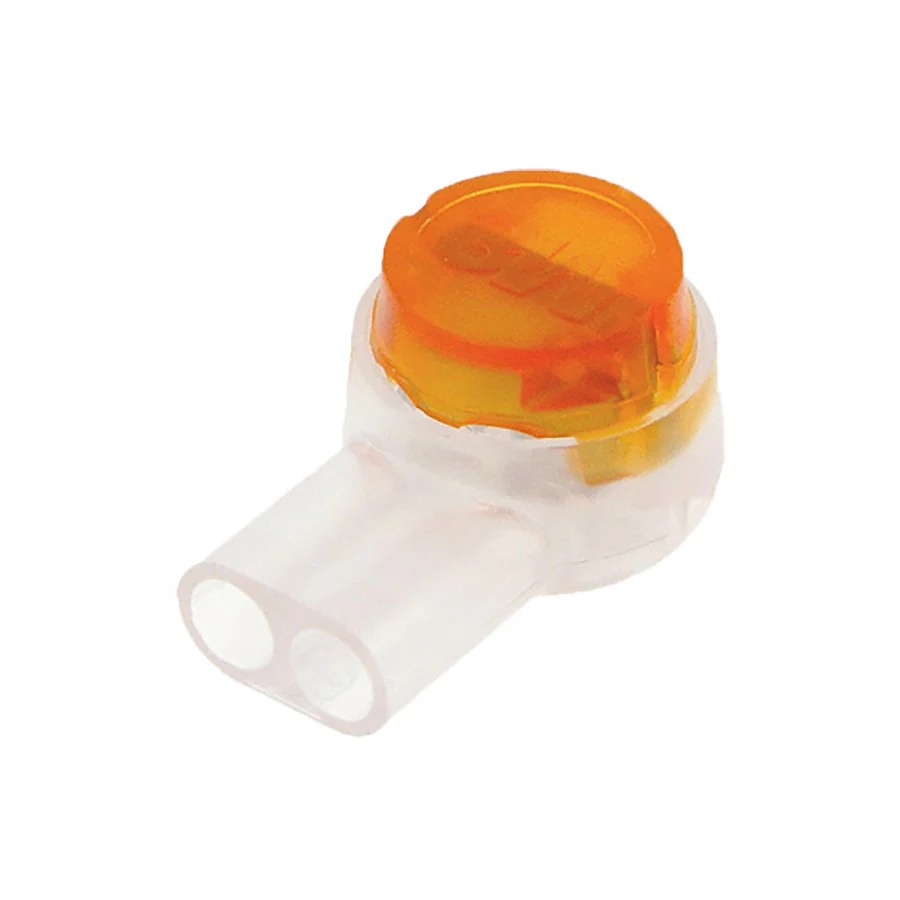
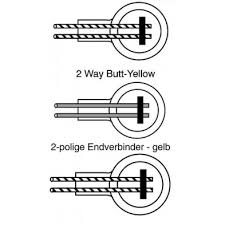
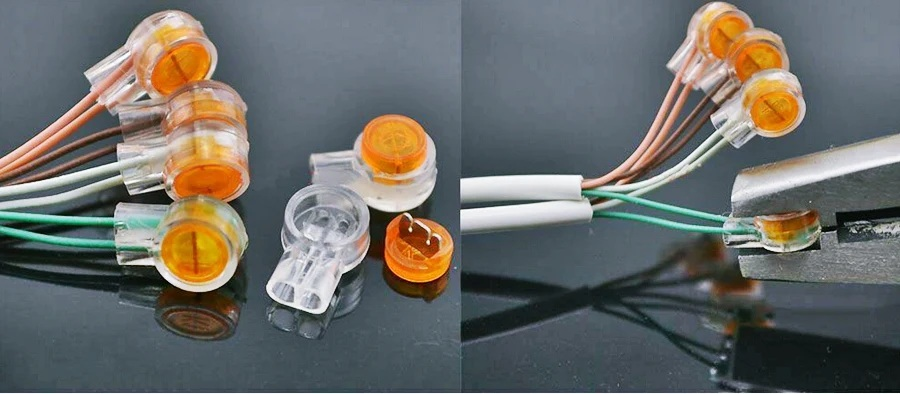
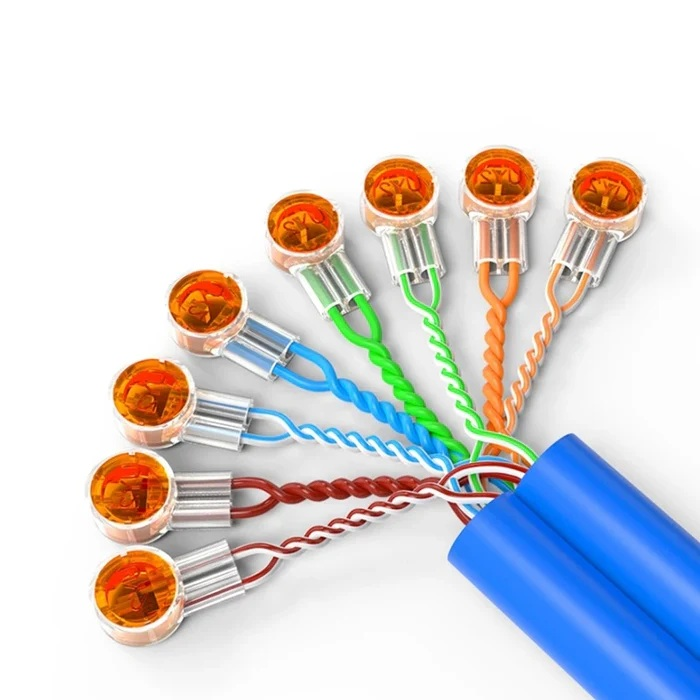

# UY2 Connector

🏷️ These guide provides step‑by‑step instructions and reproducible workflows, helping technicians and IT teams apply UY2 connectors in telecom, networking, and emergency repair scenarios.

---

## 📌 Purpose
The **UY2 connector**, manufactured by **Corning (Presslok™ series)**, is a gel‑filled butt splice connector designed to quickly join two copper wires without stripping insulation.  
It is widely used in telecom and networking environments for fast, reliable splicing of twisted‑pair cables.

⚠️ **Disclaimer**  
This connector can be used to make **temporary joints between Ethernet copper cables**, but it is **not recommended as a permanent solution**.  
Every cable installed in professional infrastructure should be a certified one. UY2 connectors are only a **workaround** to keep things connected quickly when no other option is available.

---

## 🚀 Practical Use Cases

### 🖧 Telecom & Networking
Used extensively in telephone wiring and DSL lines to splice twisted‑pair copper quickly.

### 🛠️ Temporary Ethernet Joints
In emergency scenarios, UY2 connectors can be used to join Ethernet copper cables to restore connectivity.  
This is a **temporary fix** — suitable for labs, troubleshooting, or field repairs when certified cabling is unavailable.

### 🚚 Field Repairs
Technicians rely on UY2 connectors for fast splicing in outdoor or damp environments thanks to their gel‑filled moisture protection.

---

## 🛠️ Tools Needed
To use the UY2 connector effectively and reliably, technicians should have the proper tools on hand:
- Presslok™ Crimp Tool (or equivalent) – Designed to press the colored cap evenly, ensuring the blades pierce insulation correctly or a Clamp.
- Cable Cutter/Stripper – Even though UY2 connectors pierce insulation, cutters are useful for trimming damaged ends before splicing.
- Insulation Tape or Heat‑Shrink Tubing – For isolating and protecting the joint after crimping.
- Silicone Sealant (optional) – Adds extra moisture protection in outdoor or damp environments.
👉 Using the correct crimp tool is critical — improvised tools may not apply enough pressure, leading to unreliable contact or damage to the connector.

---

## 🧩 Structure of the UY2 Connector
The UY2 connector is a compact, gel‑filled butt splice designed for quick copper wire joints. Its structure is simple but engineered for reliability:
- Outer Shell (Cap & Body)
Made of durable plastic, the shell consists of a translucent body and a colored cap (usually red or orange). The cap is pressed down with a crimp tool to complete the splice.
- Metal Contact Blades
Inside the connector are sharp metal blades that pierce the insulation of the inserted wires. These blades cut through the plastic coating and establish direct electrical contact with the copper conductors.
- Gel Filling
The interior is filled with a moisture‑resistant gel. This protects the splice from water ingress, oxidation, and corrosion, making it suitable for outdoor or damp environments.
- Wire Entry Ports
Two small openings allow insertion of copper wires (26–19 AWG). The design ensures proper alignment so the blades pierce correctly during crimping.
- Locking Mechanism
Once the cap is pressed down, it locks into place, securing the wires and maintaining consistent pressure on the contact blades.

---

## ⚙️ Technical Specifications
- **Manufacturer:** Corning (Presslok™ series)  
- **Type:** Butt splice connector  
- **Wire Capacity:** 2 wires per connector  
- **Wire Range:** 26–19 AWG (≈0.4 mm to 0.9 mm diameter)  
- **Insulation:** Pierces insulation, no stripping required  
- **Protection:** Gel‑filled interior for moisture resistance  
- **Application:** Low‑voltage copper (signal, telecom, Ethernet workaround)

---

## 🔗 Related Connectors
The UY2 is part of a broader family of gel‑filled splice connectors, each designed for slightly different scenarios:
- UY2 (2‑wire splice)
Joins two copper conductors (26–19 AWG). Best for straight splicing.
- UR2 (3‑wire splice)
Allows branching connections by joining three conductors. Useful when extending or splitting a line.
- UB2A (tap splice)
Designed for tapping into an existing line without cutting it. Ideal for adding a branch connection while keeping the main run intact.

---

## 🖥️ How It Works
- Insert two copper wires into the connector.  
- Use a proper crimp tool to press down the cap.  
- The connector pierces insulation and makes contact.  
- Gel filling protects the splice from moisture and corrosion.  

> This first example shows how you should use the UY2 Connector.

> This second example shows how it should look after all the joints have been secured with the clamp and the silicone.

> **You got to make sure that the cables are deep enough through the wire entry ports to reach the metal contact blades for it to have contact when you press the locking mechanism with the clamp!**

After this, it is recommended that you tape the cable ***to isolate and protect it.***

---

## ✅ Key Features
- **Moisture Protection:** Gel filling prevents oxidation and water ingress.  
- **Ease of Use:** No need to strip insulation.  
- **Durability:** Resistant to solvents and environmental stress.  
- **Compact Size:** Fits easily into junction boxes or cable bundles.  
- **Speed:** Enables quick splicing in field conditions.  

---

## ⚠️ Limitations
While UY2 connectors are reliable for quick copper joints, they introduce signal integrity loss when used with Ethernet cables:
- **Twist Disruption:** Ethernet relies on precise twist ratios in each pair to minimize crosstalk. A splice interrupts this geometry.
- **Impedance Mismatch:** Certified Ethernet cabling is manufactured to strict impedance standards (100 Ω). A splice alters this balance, leading to reflections and degraded performance.
- **Shielding Loss:** Splicing breaks the continuity of shielding or jacket integrity, exposing the cable to external interference.
- **Performance Impact:** Even if connectivity is restored, throughput and stability may suffer — especially at higher speeds (Gigabit and above).
- **Standards Compliance:** Splicing Ethernet cables with UY2 connectors does not meet TIA/EIA or ISO cabling standards.
👉 This is why UY2 connectors should only be used as a temporary workaround for Ethernet. For permanent installations, always replace the spliced section with certified cabling to ensure compliance and long‑term reliability.

---

## 👥 Who Should Use It
- Telecom technicians working with copper lines.  
- Network engineers needing quick field repairs.  
- IT support teams handling emergency connectivity issues.  
- Lab users experimenting with copper splicing scenarios.  

---

## 🕒 When to Use It
- Emergency Ethernet splicing to restore connectivity.  
- Quick telecom repairs in the field.  
- Temporary lab setups where certified cabling isn’t available.  

---

## 🚫 When Not to Use It
- As a permanent Ethernet solution.  
- For high‑voltage or high‑current wiring.  
- In enterprise environments requiring certified cabling.  

---

## 🧭 Best Practices
When applying UY2 connectors, follow these guidelines to ensure a reliable splice:
- ✅ Verify wire gauge before insertion (must be 26–19 AWG).
- ✅ Insert wires fully so they reach the metal contact blades.
- ✅ Use the proper crimp tool to press the cap evenly and lock the splice.
- ✅ Check for secure locking — the cap should sit flush with the body.
- ✅ Tape or heat‑shrink after crimping to isolate and protect the joint.
- ✅ Avoid excessive bending of the spliced section to maintain contact integrity.

---

## 📖 Scenario Examples
Here are use case scenarios where this connector could be useful, in case you never used it:
- **Branch Office Emergency**
An Ethernet cable is accidentally cut during furniture rearrangement. A UY2 splice restores connectivity until certified replacement arrives.
- **Field Telecom Repair**
A technician repairing a DSL line in a rural area uses UY2 connectors to quickly splice twisted‑pair copper and restore phone service.
- **Outdoor Security Camera Setup**
A copper run powering IP cameras is damaged by weather. UY2 connectors provide a temporary joint to keep surveillance online until proper cabling can be re‑installed.
- **Lab Experimentation**
In a networking lab, UY2 connectors are used to splice test cables quickly during troubleshooting exercises without needing to re‑terminate RJ45 ends.
- **Temporary Network Extension**
A small office needs to extend a copper run to a workstation urgently. UY2 connectors allow a quick splice to bridge the gap until structured cabling can be installed.

---

## ⚡ My Experience
In my personal experience, **UY2 connectors are lifesavers for quick copper splicing**.  
I’ve used them to restore Ethernet connectivity in labs and field scenarios when certified cables weren’t immediately available.  
They are compact, reliable, and moisture‑resistant — but I always treat them as **temporary workarounds**.  
Once proper cabling is available, I replace the joint with a certified Ethernet cable to ensure compliance and long‑term reliability.

---

## 🎯 Summary
The UY2 connector is a **fast, gel‑filled splice solution** for copper wires.  
It shines in telecom and emergency networking scenarios where speed and reliability matter more than permanence.  
For Ethernet, it should only be used as a **temporary workaround** until certified cabling can be installed.

---

## 🗝️ Keywords

> UY2 connector, Corning Presslok, copper splice, telecom splicing, Ethernet temporary joint, gel‑filled connector, field repair, IT toolkit, infrastructure workaround, technician tools, reproducible workflows, temporary Ethernet splice, copper joint reliability, telecom field repair, emergency connectivity workaround to improve discoverability.
