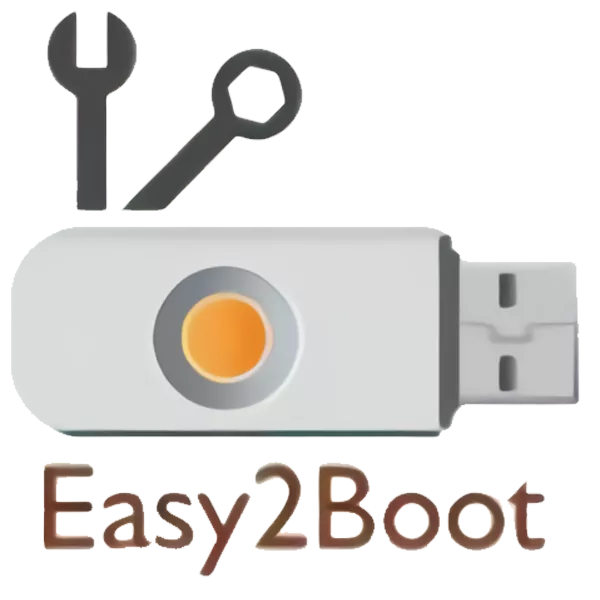
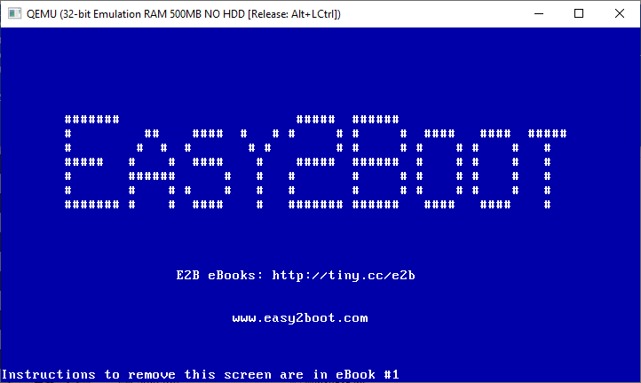
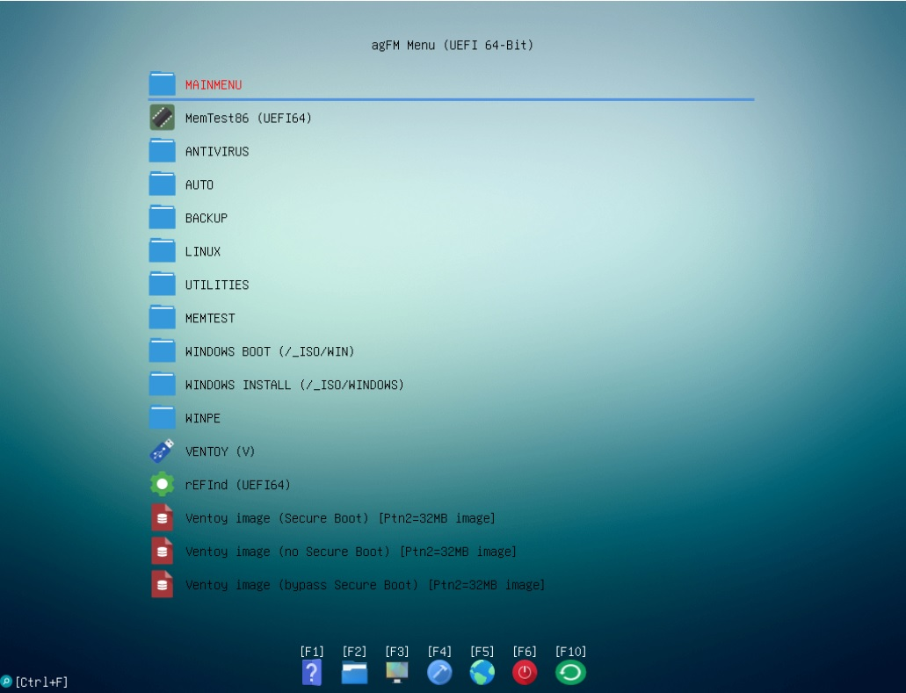

# 🔌 Easy2Boot



## 🎯 Purpose
[Easy2Boot](https://easy2boot.xyz/) (E2B) is a free flexible multiboot solution that lets you create a single USB drive capable of booting multiple operating systems, utilities, and recovery tools. Instead of preparing a new bootable USB for each ISO, you simply copy the ISO file to your Easy2Boot drive and boot from it.

---

## 💡 Practical Use Cases
- 🛠️ **IT Technicians & Engineers**: Carry one USB stick with Windows installers, Linux distros, and diagnostic tools.
- 🧰 **System Recovery**: Boot into Hiren’s BootCD, MemTest86, or antivirus rescue disks.
- 💻 **OS Deployment**: Install different versions of Windows or Linux without recreating boot media.
- 🚀 **Portable Toolkit**: Maintain a portable SSD/HDD with dozens of ISOs for field work or data center operations.






---

## ⚙️ Requirements
### Software
- 📦 Easy2Boot package (downloadable from official site).
- 🖥️ Windows system to prepare the USB drive (Linux prep possible with extra steps).

### Hardware
- 💾 USB stick (minimum 8GB - 64GB at least recommended to put several ISOs, up to 2TB).
**OR**  
- 💽 Portable USB SSD/HDD for larger ISO collections.
- 🖥️ PC or server with BIOS or UEFI firmware (**Secure Boot disabled**).

> Developer recommends Sandisk Extreme Pro USB 3 range of drives. I just use a 120GB USB 3.0 SSD.

---

## ✅ What You Can Do (Advantages)
- 📂 Boot multiple ISOs from a single device.
- 🔄 Add/remove ISOs by simple file copy—no need to reformat.
- 🧭 Supports both **Legacy BIOS** and **UEFI** boot modes.
- 🖥️ Works with Windows installers, Linux distros, utilities, and recovery tools.
- 📈 Scales from small USB sticks to large portable drives.
- ⏱️ Saves time and reduces clutter by consolidating boot media.

---

## ❌ What You Cannot Do (Limitations)
- 🔒 **Secure Boot** is not supported—you must disable it in UEFI/BIOS.
- 🍎 macOS installation ISOs are not natively supported (limited workarounds exist).
- ⚠️ Some highly customized ISOs may require manual configuration.
- 🪶 Not ideal if you only need a single OS installer (simpler tools may suffice).

---

## 🔄 Workflow Comparison

### 🪟 Traditional Boot USB Creation

```
+-------------+       +--------------+       +----------------+       +-------------------+       +----------------+       +--------+
| Download ISO| --->  | Format USB   | --->  | Write ISO Tool | --->  | Boot from USB     | --->  | Repeat for     | --->  | Time   |
|             |       | Stick        |       |                |       |                   |       | each new ISO   |       | Waste  |
+-------------+       +--------------+       +----------------+       +-------------------+       +----------------+       +--------+
```

---

### 🚀 Easy2Boot Workflow

```
+-------------+       +----------------------+       +-------------------+       +--------+
| Download ISO| --->  | Copy ISO to E2B Drive| --->  | Boot from USB     | --->  | Done   |
|             |       | (drag & drop)        |       |                   |       |        |
+-------------+       +----------------------+       +-------------------+       +--------+
```

---

### 📝 Key Difference
- **Traditional Method**: ⏳ Time-consuming, repetitive, requires reformatting for each ISO.  
- **Easy2Boot Method**: ⚡ Fast, scalable, and flexible — just drag & drop ISOs onto your drive.  

---

## 🔒 Reliability
Easy2Boot is widely trusted in IT communities because:
- 🛡️ Uses proven grub4dos/grub2 bootloader systems.
- 📂 ISO files remain untouched—no need to modify them.
- 📚 Actively maintained with strong documentation and community support.
- 🧾 Reduces risk of corrupted boot media by avoiding repeated formatting.

---

## 🖥️ Supported Tools & Operating Systems
Examples of what you can include:
- 🪟 **Windows**: Windows 7, 8, 10, 11 installers; WinPE environments.
- 🐧 **Linux**: Ubuntu, Fedora, Debian, Kali Linux, Arch Linux.
- 🔧 **Utilities**: Hiren’s BootCD PE, MemTest86, Clonezilla, GParted, antivirus rescue disks.
- 🌐 **Other Platforms**: BSD distributions, DOS utilities, lightweight recovery environments.
- 🍎 **macOS**: Limited support; not recommended for primary macOS deployment.

---

## 🚀 Why It’s Useful
Instead of creating a new bootable USB stick for each ISO:
- 📂 Just copy the ISO to your Easy2Boot drive.
- ⚡ Instantly expand your toolkit without reformatting.
- 🎒 Carry one device that covers nearly all deployment and recovery scenarios.

---

## 🧑‍🔧 Real-World Technician Scenario

### Traditional Approach
Imagine a field technician heading to a client site:
- Carries **10–20 separate USB sticks**, each prepared for a different OS or tool.
- Needs to remember which stick has Windows 10, which has Ubuntu, which has Hiren’s BootCD, etc.
- Risk of losing or mixing them up, plus wasted time reformatting when updates are needed.

---

### Easy2Boot Approach
With Easy2Boot:
- Carries **one portable SSD or large USB stick** with all ISOs stored inside.
- Simply copies new ISOs to the drive before heading out — no reformatting required.
- Boots into Windows installers, Linux distros, or recovery tools from the same device.
- Saves **hours of prep time** and reduces clutter in the toolkit bag.

---

### Field Impact
- **Efficiency**: Faster response to client issues — no fumbling with multiple drives.
- **Reliability**: One well‑maintained Easy2Boot device replaces dozens of single‑purpose sticks.
- **Professionalism**: Shows up with a streamlined, organized toolkit that signals expertise.

---

## 🔧 Compatibility
- 🖥️ **Legacy BIOS**: Fully supported.
- 🧭 **UEFI**: Supported (Secure Boot must be disabled).
- 🌍 Works across desktops, laptops, and servers with mixed firmware environments.

---

## 🌍 Use Cases in Enterprise
- Disaster recovery in data centers.
- Rapid OS deployment for labs or classrooms.
- Portable toolkit for consultants.

---

## 🗝️ Keywords

Easy2Boot, multiboot USB, boot multiple ISOs, Windows installer USB, Linux live USB, Hiren’s BootCD, MemTest86, Clonezilla, GParted, portable SSD boot, BIOS boot, UEFI boot, disable secure boot, IT toolkit, system recovery, OS deployment
