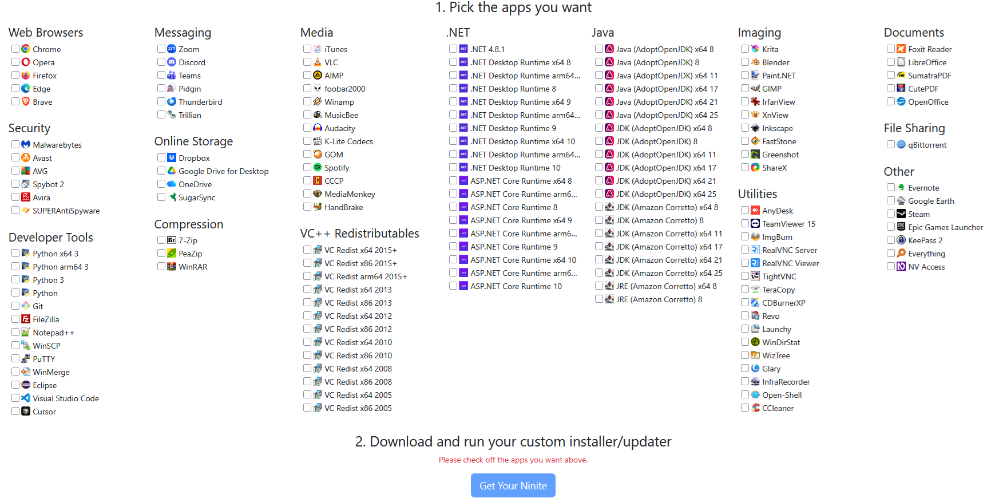

# Ninite

## 📚 Documentation Index
Quick links to detailed guides for different deployment scenarios:
- [Integration with PowerShell](./scripts/integration-with-powershell.md)
- [Automation with Task Scheduler](./scripts/automating-with-task-scheduler.md)
- [Network Deployment Scenarios](./scripts/network-deployment/readme.md)

🏷️ These guides provide step‑by‑step instructions and reproducible workflows, helping technicians and IT teams integrate Ninite into automation routines, scheduled updates, and network‑wide deployments.

---

## 📌 Purpose
[Ninite](https://www.ninite.com) is a bulk software installer and updater designed to automate the deployment of common applications on Windows systems.
It eliminates repetitive manual installation steps by silently installing selected programs with default settings.

---

## 🚀 Practical Use Cases

### 🖥️ Bulk Software Deployment
Ninite simplifies bulk software deployment by packaging multiple applications into a single installer, reducing repetitive manual steps during OS rollouts.

### ⚙️ Windows Automation Scripts
With PowerShell integration, Ninite can be executed as part of Windows automation scripts, ensuring updates and installs run silently and consistently.

### 🏢 MSP Software Update Workflows
For MSPs and enterprise teams, Ninite supports reproducible update workflows across multiple endpoints, especially when combined with Task Scheduler or Intune.

---

## ⚙️ How It Works
- Visit ***www.ninite.com*** and select the applications you want.
- Select all the software to make and download the installer package.
- Run the installer — Ninite automatically installs or updates all selected apps in the background:
- No prompts, clicks, or license agreements.
- Installs with default settings.
- Skips unnecessary toolbars or add‑ons.
- Can be run repeatedly to keep software up to date.

---

## 🖥️ Installation Modes
- Runs silently in the background.
- Requires no user interaction once launched.
- If executed with administrator rights, installs system‑wide without prompts.
- Skips reboot requests until the end, allowing batch installs to complete uninterrupted.
- Ideal for unattended installs in enterprise or lab environments.

---

## ✅ Benefits
- Automation: One executable handles multiple installations.
- Time‑saving: Ideal for fresh OS deployments or mass updates.
- Consistency: Ensures uniform configurations across machines.
- Silent operation: No user interaction required.
- Integration: Can be scripted into deployment workflows or integrated with Microsoft Intune for enterprise rollouts.
- The same Ninite installer can be re‑run at any time to update apps to their latest versions.

---

## 🔒 Security & Reliability
- Ninite always downloads installers directly from official vendor sources.
- Installs are performed silently with no risk of unwanted add-ons.
- Re-running the same installer ensures apps are updated to the latest version.

---

## ⚠️ Limitations
- Only supports applications available in Ninite’s catalog.
- Limited customization (always installs with default options).
- Requires internet access for downloads.
- Some applications are not free (e.g., WinRAR, TeamViewer commercial use, Zoom for enterprise licensing).
- No support for macOS or Linux.

---

## 👥 Who Should Use It
- IT technicians deploying multiple systems.
- MSPs and enterprise support teams needing consistent software baselines.
- Home lab users who want quick, reproducible setups.

---

## 🕒 When to Use It
- After a fresh Windows installation.
- During onboarding of new devices.
- For regular updates of common applications.
- In automated deployment workflows (e.g., Intune, SCCM, scripts).

---

## 🚫 When Not to Use It
- When you need custom install options (e.g., non‑default paths, advanced settings).
- For applications not included in Ninite’s catalog.
- In environments requiring strict manual approval for each installation.

---

## 📦 Some (but not all) Tools Available
Ninite supports a wide range of popular applications, including:
- Browsers: Chrome, Firefox, Edge
- Messaging: Zoom, Discord, Skype
- Utilities: 7‑Zip, WinRAR (commercial license required), Notepad++
- Runtimes: Java, .NET, Python
- Security: Malwarebytes, Avast
- Media: VLC, Spotify
- Cloud: Dropbox, OneDrive, Google Drive

---

## ⚡ My Experience
In my personal experience, **Ninite has always been a reliable source for bulk software deployment**.  
Because it fetches installers directly from the official vendor pages, I’ve trusted it both for **initial installs** and for **updates**.  

It consistently saves time by packaging multiple applications and dependencies into a single silent installer — just a few clicks and the job is done.  
For environments where automation matters, I’ve used Ninite with **PowerShell scripts** and **Task Scheduler** to ensure reproducible updates across endpoints.  

👉 You can check and download example scripts for automation and integration in this section to see how updates can be streamlined even further.

---

## 💼 Ninite Pro
The Pro version extends functionality for IT teams:
- Remote installation and updates across multiple PCs simultaneously.
- Centralized management with a simple UI.
- Integration with Intune and other enterprise deployment tools.
- Faster updates with caching.
- Licensing designed for MSPs and enterprise environments.

## 🛠️ **BONUS!** PowerShell Integration Guide
If you’d like to go beyond the basics and automate Ninite’s usability with PowerShell, this repository includes a dedicated guide:

👉 [Ninite-Powershell-Integration-Guide](./scripts/integration-with-powershell.md)

That section walks through how to:
- Run Ninite silently via PowerShell scripts
- Schedule updates or deployments
- Integrate Ninite into larger automation workflows
You’ll also find a ready‑to‑use script (ninite-install.ps1) in the same folder, which you can download and adapt for your environment.

---

## 🎯 Summary
Ninite is a time‑saving automation tool for Windows software deployment.
It shines in environments where speed, consistency, and simplicity matter more than customization.
For enterprise use, Ninite Pro adds remote management and integration capabilities, making it a strong fit for MSPs and IT departments
This makes Ninite a practical choice for bulk software deployment, Windows automation scripts, and MSP software update workflows.

---

## 🗝️ Keywords

Ninite, bulk software deployment, silent installer, Windows automation, MSP software updates, enterprise IT workflows, reproducible deployments, endpoint management, IT toolkit, infrastructure automation, portable installer, task scheduler integration, Intune automation, PowerShell scripts, software update automation, technician tools, enterprise IT portfolio, OS rollout automation, IT catalog
