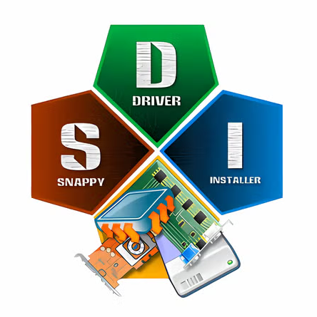

# Snappy Driver Installer (SDI)

📌 [Snappy Driver Installer](https://sdi-tool.org/) (SDI) is a **free, open-source driver installation utility** designed to simplify one of the most frustrating tasks in IT: finding and installing the right drivers for your hardware.

---

## 🔧 What SDI Does
- Detects missing, outdated, or broken drivers on your system.
- Finds and installs drivers from one of the most complete driver databases available.
- Works **offline or online**:
  - **Portable mode**: download drivers only when needed.
  - **Full driver pack**: keep a local repository of 50+ GB of drivers for use across multiple systems.
- Creates a **system restore point automatically** before making changes, ensuring safety and rollback capability.

---

## 🎯 What SDI Is For
- IT professionals, technicians, and power users who need a reliable driver solution.
- Quickly restoring functionality after OS installations or hardware upgrades.
- Automating driver installation to save time and reduce manual searching.

---

## 🚫 What SDI Is *Not* For
- It is **not** a "system optimizer" or "registry cleaner."
- It does **not** install unnecessary software, bloatware, or paid add-ons.
- It is **not** a magic fix for every PC issue — but it is a practical, community-supported tool that works.

---

## 💡 Why SDI Stands Out
Unlike many paid driver installers and so-called "optimization tools" that:
- Charge for features that don’t solve real problems.
- Bundle unnecessary software or ads.
- Provide limited driver coverage.

**SDI is different:**
- 100% **free** and **open source**.
- Maintained by developers in their free time.
- Offers one of the **largest driver databases** available.
- Trusted by IT professionals worldwide.

---

## 🔒 Security Features

Snappy Driver Installer (SDI) is designed with safety and transparency in mind. While many paid driver tools bundle ads or risky software, SDI focuses only on drivers and includes several protections:

- **Automatic System Restore Point**  
  Before installing or updating drivers, SDI creates a restore point so you can roll back if needed.
- **No Adware or Bloatware**  
  SDI does not install extra software, ads, or “optimizers.” It’s clean and focused only on drivers.
- **Open Source Transparency**  
  The code is open source, meaning the community can review it for hidden or malicious behavior.
- **Portable Execution**  
  SDI can run directly from a USB drive without installation, reducing attack surface and leaving no permanent footprint.
- **Driver Pack Verification**  
  Driver packs are curated and updated by the community, minimizing the risk of corrupted or unsafe drivers.
- **Official Distribution**  
  Safe use requires downloading only from the official site ([sdi-tool.org](https://sdi-tool.org/)) to avoid tampered versions.

---

## 🌍 Supported Operating Systems
- Windows XP
- Windows Vista
- Windows 7
- Windows 8 / 8.1
- Windows 10
- Windows 11
- **Windows Server editions**

---

## 📥 Downloads
Always download SDI from the official site to ensure authenticity:

- [Download Page - Select your version](https://sdi-tool.org/download/)
- [Full Version (with driver packs, ~50GB)](https://sdi-tool.org/SDI_Update.torrent) ⚠️ **Needs P2P Torrent Client, like BitTorrent**
- [Lite Version (portable, downloads drivers on demand)](https://driveroff.net/drv/SDI_1.26.1.7z) 

---

## ⚡ My Experience
I am **not the owner or developer** of this software — I am an advanced user who has relied on SDI extensively in infrastructure deployments across both **endpoints and servers**.  

In my work as an infrastructure technician and engineer, SDI has consistently proven to be the **best tool for installing drivers**.  
It has solved countless scenarios where manual driver hunting would have taken hours. SDI automates the process, saves headaches, and delivers results quickly.  

It’s not the *panacea* for every system issue, but it’s a powerful, community-backed solution that I recommend to anyone dealing with driver installation.

---

## 📊 Workflow Diagram
Here’s a simple visualization of how SDI operates:

**Detect → Download → Restore Point → Install → Reboot**

---

## 🤝 Community & Support
- Active community of developers and users.
- Transparent, open-source development.
- Contributions and feedback are welcome.

---

## 📌 Key Takeaways
- **Free, open source, portable.**
- **Massive driver coverage** — almost any driver you’ll ever need.
- **Supports Windows Server** alongside desktop editions.
- **Secure** — creates restore points automatically.
- **Saves time and frustration** compared to manual searches.
- **No gimmicks, no bloatware, no false promises.**

---

## ⚠️ Online vs Offline mode usage
👉 [Online vs Offline guide](./docs/online-vs-offline.md)

---

## 🔗 Learn More
👉 Visit the official site: [https://sdi-tool.org/](https://sdi-tool.org/)

---

## 📄 Portfolio Context (Recruiter-Friendly Highlights)
As part of my **Practical IT Toolkit Catalog**, I highlight Snappy Driver Installer (SDI) as a prime example of how I curate **reliable, reproducible solutions** for real-world infrastructure scenarios.  
- Demonstrates my ability to evaluate tools critically against paid alternatives.  
- Shows my focus on **automation, operational clarity, and community-backed solutions**.  
- Reflects my hands-on experience solving driver-related challenges across diverse environments, including **Windows Server**.  

This README is not just documentation — it’s a **case study** in how I approach IT problem-solving: practical, transparent, and recruiter-friendly.

